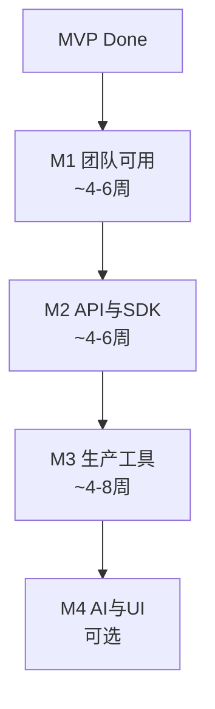

# unity-wasm 开发路线图（M1–M4）

> **文档用途**：作为后续分阶段 Plan 与实现的**总纲**。每个里程碑（M1～M4）将单独产出详细 Plan 并编码；本文只定义边界、交付物、任务粒度与验收标准。
>
> **最后更新**：2026-06（基于 MVP 已跑通：`selection-logger` + 热重载 + Trap 报告）

---

## 0. 项目定位（不变）

| 项 | 内容 |
|----|------|
| 产品 | Unity Editor WASM 扩展平台（`com.fumo.editor-wasm`） |
| 用户 | 引擎工具组 / 客户端工具组 |
| 运行环境 | Unity 2022.3 LTS Editor（Win / macOS / Linux） |
| 明确不做 | 游戏运行时 Mod、出包、IL2CPP、移动端、完整 UnityEditor 反射暴露 |

**核心价值排序**：崩溃隔离 → 免 Domain Reload 热重载 → 多语言工具 → 现代调试 → AI 友好 Schema

---

## 1. 当前基线（MVP Done）

### 1.1 已实现

- **运行时**：Wasmtime .NET + Native 插件；`WasmEditorHost`（Load / Call / Unload / Fuel / MemoryLimit / TrapReport）
- **Host API**：`editor_core`、`editor_selection`、`editor_assets`（Tier 0–2，C# 手工实现）
- **基础设施**：`ToolDiscoveryService`、`HotReloadService`（300ms debounce）、`HandlePool`、`ToolWindowShell`
- **契约**：`wit/editor-api/`（文档级 WIT，与实现未完全代码生成联动）
- **示例**：`examples/selection-logger`（Rust + 预编译 `bin/tool.wasm`）
- **辅助**：`SchemaExporter`、`ToolRegistryExporter`、`HostBindingGenerator`（基础）、`WebViewBridge` / `SelfHealingLoop`（占位）
- **工程**：`sample-project`、`.gitignore`、`docs/*`

### 1.2 已知缺口（驱动 M1+）

1. 工具菜单写死（`tool.json.menu` 未驱动动态入口）
2. WIT 与 C# / Rust 实现双轨（无 wit-bindgen / Host 生成）
3. 仅 1 个示例，Tier 2 资产 API 未经真实工具验证
4. 无 Tier 3（Scene 只读）/ Tier 4（写操作）
5. 无 CI、无正式 Rust SDK 模板
6. WebView / AI 闭环未实现

---

## 2. 里程碑总览



| 里程碑 | 一句话目标 | 完成后团队能做什么 |
|--------|------------|-------------------|
| **M1** | 多人可独立开发并运行第 2、3 个工具 | 加 `tool.json` 即可跑，不改编宿主 C# |
| **M2** | WIT 与实现一致，Rust SDK 正式化 | 改 WIT → 生成绑定，工具按 SDK 写 |
| **M3** | 支撑扫描/检查类生产工具 | 大项目资产遍历、只读/可控写操作 |
| **M4** | 富 UI + AI 辅助闭环（可选） | Web 面板 + Trap 驱动半自动修复 |

**依赖关系**：M2 依赖 M1 至少 2 个示例反馈；M3 依赖 M2 ABI 稳定；M4 依赖 M2 SDK 与 M1 工具流程。

---

## 3. M1 — 团队可用

### 3.1 目标

从「Demo 能跑」升级为「工具组可日常接活」：新工具零 C# 改动、有模板、有第二示例、有基础 CI。

### 3.2 交付物清单

| ID | 交付物 | 类型 |
|----|--------|------|
| M1-D1 | 动态工具启动入口（菜单或 Launcher 窗口） | 代码 |
| M1-D2 | `examples/asset-scanner` 示例工具 | 代码 + wasm |
| M1-D3 | `sdk/rust/template` 可复制模板 | 仓库 |
| M1-D4 | Tool Shell 增强（工具列表 / Run / Trap 复制） | 代码 |
| M1-D5 | CI：构建全部 examples 的 wasm | 配置 |
| M1-D6 | `docs/getting-started-tool-dev.md` | 文档 |

### 3.3 任务分解（可单独开 Plan / Issue）

#### M1-T1 动态工具入口

- **内容**：
  - 方案 A（推荐）：`Tools → Wasm Editor → Run Tool →` 子菜单由 `ToolDiscoveryService.DiscoverAll()` 动态填充
  - 方案 B（并行）：Tool Shell 内工具列表 + Run 按钮
  - Refresh Tools 后更新菜单/列表；按 `tool.json.id` 调用 `WasmEditorRuntime.InvokeTool(id)`
- **不在此任务**：快捷键（可 M1-T7 后续）、动态 `[MenuItem]` 反射注册
- **验收**：
  - 新增仅含 `tool.json` + `bin/tool.wasm` 的目录，Refresh 后可见并可 Run
  - 无需修改 `UnityWasmMenu.cs` / `ToolMenuRegistry`

#### M1-T2 示例 `asset-scanner`

- **内容**：
  - 调用 `editor_assets.find_assets_count` / `find_asset_at`
  - 调用 `editor_core.show_progress` / `clear_progress`
  - 扫描 `Assets` + filter 如 `t:Texture` 或 `t:Prefab`
  - 输出：总数 + 抽样前 N 条路径到 log
- **验收**：
  - 中型项目（1k+ 资产）可跑完且有进度条
  - trap 不杀 Editor；Tool Shell 可见日志

#### M1-T3 Rust 模板 `sdk/rust/template`

- **内容**：
  - `Cargo.toml`（cdylib、`CARGO_TARGET_DIR=target` 说明）
  - `src/lib.rs`：export 骨架 + 常用 import 声明
  - `tool.json` 模板、`build.sh`
  - 与 `docs/host-api.md` import 模块名一致
- **验收**：按 README 复制模板 → 30 分钟内得到可加载的 hello 工具

#### M1-T4 Tool Shell 增强

- **内容**：
  - 已发现工具列表（id / name / abi / wasm 路径）
  - 每工具 Run 按钮；显示 last reload 时间
  - Trap 区域「复制 JSON」按钮
  - 可选：当前选中工具状态
- **验收**：Selection Logger + asset-scanner 均可在 Shell 内 Run

#### M1-T5 CI 构建 wasm

- **内容**：
  - GitHub Actions（或同等）：`rustup target add wasm32-unknown-unknown`
  - 对 `examples/*/build.sh` 或统一 `scripts/build-all-examples.sh` 执行
  - 失败则 PR 红
- **验收**：改 `selection-logger` 破坏 export 名 → CI 失败

#### M1-T6 工具开发者文档

- **内容**：
  - 目录结构、`tool.json` 字段、export 约定
  - build / 热重载 / 调试 trap / 常见错误
  - 与 README Quick Start 分工：README 面向试用，本文面向开发
- **验收**：新同事仅读此文可完成首个工具

#### M1-T7（可选）快捷键

- **内容**：解析 `tool.json.shortcut`，接 Unity `ShortcutManagement`
- **验收**：配置 shortcut 的工具可通过快捷键 Run

### 3.4 M1 整体验收标准

- [ ] ≥2 个示例工具（selection-logger + asset-scanner）在 sample-project 中可发现、可 Run、可热重载
- [ ] 第 3 个工具由工具组按模板独立完成，平台组零 C# 改动
- [ ] CI 通过 wasm 构建
- [ ] 删除 `ToolMenuRegistry` 中写死的 `RunSelectionLogger`（或仅作 fallback 示例）

### 3.5 M1 风险

| 风险 | 缓解 |
|------|------|
| 动态菜单在 Unity 版本间行为差异 | 优先 Tool Shell Launcher，菜单为补充 |
| asset-scanner 大项目卡顿 | M1 允许同步+进度条；分帧放 M3 |

---

## 4. M2 — API 与 SDK 正式化

### 4.1 目标

消除 WIT / C# / Rust 漂移；建立 ABI 版本策略；补齐 Tier 3 只读 Scene API；调试体验可文档化复现。

### 4.2 交付物清单

| ID | 交付物 | 类型 |
|----|--------|------|
| M2-D1 | ABI 版本校验（加载时检查 `tool.json.abi`） | 代码 |
| M2-D2 | WIT → Host import 注册代码生成（或等价契约测试） | 代码 + 脚本 |
| M2-D3 | Rust wit-bindgen / 生成 guest 绑定 workflow | sdk + 文档 |
| M2-D4 | Tier 3 `editor-scene` Host 实现 + WIT | 代码 |
| M2-D5 | 示例 `prefab-inspector-lite` | 代码 + wasm |
| M2-D6 | 契约测试（wasm 期望 import 与 Host 一致） | 测试 |
| M2-D7 | `docs/debugging.md` 扩充 + Verbose import log | 文档 + 代码 |

### 4.3 任务分解

#### M2-T1 ABI 版本策略

- **内容**：
  - 定义 `editor-api/1` 兼容规则（additive vs breaking）
  - `WasmEditorHost.Load` 前校验 manifest.abi；不支持则拒绝并 Console 明确报错
  - 文档：`docs/abi-versioning.md`
- **验收**：abi 写 `editor-api/99` 的工具无法加载且有提示

#### M2-T2 Host 绑定生成

- **内容**（二选一，Plan 时定案）：
  - **路径 A**：从 WIT 生成 `EditorHostBridge.Imports.g.cs`（仅 DefineFunction 注册表）
  - **路径 B**：手写 + `tests/contract/` wasm 模块断言 import 名/signatures
- **验收**：WIT 增删 import 后，generate/测试能发现 Host 未同步

#### M2-T3 Rust SDK workflow

- **内容**：
  - 模板改用 wit-bindgen（或 document 手工 extern 与 WIT 对齐流程）
  - `sdk/rust/README.md`：build、bindgen、与 Host memory 字符串约定
  - 迁移 `selection-logger` 或新示例使用生成绑定
- **验收**：Rust 侧不再复制粘贴 import 签名

#### M2-T4 Tier 3 editor-scene（只读）

- **WIT 草案**：
  - `get-object-path(handle) -> option<string>`
  - `get-serialized-property(handle, property-path) -> result<string,string>`（JSON via FMBO）
- **验收**：prefab-inspector-lite 可读选中 Prefab 根节点组件列表（或 1 层属性）

#### M2-T5 示例 prefab-inspector-lite

- **依赖**：M2-T4
- **验收**：选中 Prefab 资产 Run 后 Console 输出组件/type 摘要

#### M2-T6 契约测试

- **内容**：最小 wasm 仅调用各 import 一遍；CI 加载并 Instantiate 不报错
- **验收**：Host 漏注册 import → CI 失败

#### M2-T7 调试增强

- **内容**：Editor 开关 Verbose Host Import Log；Tool Shell 显示最近 N 条 trace
- **验收**：与 `docs/debugging.md` 步骤一致可复现

### 4.4 M2 整体验收标准

- [ ] WIT 为 import 唯一真理来源（生成或契约测试 enforce）
- [ ] ≥1 个 Rust 示例使用 wit-bindgen（或官方推荐流程）
- [ ] Tier 3 只读 API 有示例覆盖
- [ ] ABI 不匹配时 fail-fast

### 4.5 M2 风险

| 风险 | 缓解 |
|------|------|
| wit-bindgen 与 wasm32-unknown-unknown 工具链复杂度 | M2 Plan 先做 spike（1–2 天） |
| 生成代码与 Unity asmdef 冲突 | 输出到 `Generated/`，git 跟踪策略在 Plan 中定 |

---

## 5. M3 — 生产级工具支撑

### 5.1 目标

支撑真实工具链：大资产扫描、Prefab/序列化检查、可控写操作；性能与隔离有规范。

### 5.2 交付物清单

| ID | 交付物 | 类型 |
|----|--------|------|
| M3-D1 | `docs/performance.md` + Host 分帧/进度最佳实践 | 文档 |
| M3-D2 | 大资产扫描 Host 优化（可选分帧 callback） | 代码 |
| M3-D3 | Tier 4 `editor-mutating` WIT + Host（独立 interface） | 代码 |
| M3-D4 | 示例：只写工具（如批量重命名 / 设置单一属性） | 代码 + wasm |
| M3-D5 | 多工具 HandlePool / Host 实例隔离审计与修复 | 代码 |
| M3-D6 | AssemblyScript 模板（可选） | sdk |
| M3-D7 | 示例：命名规范 / 轻量 validator（AS 或 Rust） | 代码 |

### 5.3 任务分解

#### M3-T1 性能规范

- **内容**：
  - 单次 FFI 字符串上限建议；bulk FMBO 使用场景
  - 遍历资产必须 progress；万级资产预期行为
  - 主线程 vs 外部 CLI 分工（重型 pipeline 用 CLI + Editor 触发）
- **验收**：asset-scanner 按规范 refactor；文档 review 通过

#### M3-T2 Host 分帧（按需）

- **内容**：`find_assets` 系列支持 batch + cursor；或 EditorApplication.update 驱动多步
- **触发条件**：M1 asset-scanner 在中型项目明显 freeze >5s
- **验收**：1 万资产扫描 Editor 可响应 progress 取消（可选）

#### M3-T3 Tier 4 mutating API

- **内容**：
  - 独立 WIT world / interface：`set-serialized-property`、`save-assets`
  - 与 Undo 集成（`Undo.RecordObject`）
  - manifest 标记 `capabilities: ["mutating"]`（可选）
- **验收**：示例工具完成单一写操作 + Undo 可撤销

#### M3-T4 多工具隔离

- **内容**：审计 `HotReloadService` 多 host；HandlePool  per-host；文档说明 stale handle
- **验收**：同时加载 2 个工具，交替 Run 无交叉 handle 错误

#### M3-T5 生产向示例（二选一或都做）

- **prefab-checker**：规则检查（命名、缺失组件、layer）
- **csv-export-lite**：读配置 + 扫描资产 + 输出 CSV 到 Console（不写盘）或 bulk memory

#### M3-T6 AssemblyScript 模板（可选）

- **内容**：`sdk/assemblyscript/template` + 与 Rust 相同 import 名
- **验收**：AS hello 工具可加载 Run

### 5.4 M3 整体验收标准

- [ ] 至少 1 个「生产复杂度」示例（扫描 + 规则 / 导出）
- [ ] mutating API 有独立文档与 Code Review 可见边界
- [ ] 性能文档被工具组采纳
- [ ] 内部 ≥3 个日常 wasm 工具（含 M1/M2 示例 + 新工具）

### 5.5 M3 风险

| 风险 | 缓解 |
|------|------|
| 写 API 导致资产损坏 | 强制 Undo + 示例仅单属性；mutating capability 显式声明 |
| 分帧过度设计 | 仅在大项目实测后做 M3-T2 |

---

## 6. M4 — AI 与富 UI（可选）

### 6.1 目标

Web 工具 UI、Trap 驱动半自动修复、Agent 一体化 Schema；**不**在 Editor 内嵌 LLM。

### 6.2 交付物清单

| ID | 交付物 | 类型 |
|----|--------|------|
| M4-D1 | WebView 选型报告 + 集成 POC | 文档 + 代码 |
| M4-D2 | `WebViewBridge` 完整 postMessage 协议 | 代码 |
| M4-D3 | 示例：简单 HTML 面板 + wasm 逻辑分离 | 示例 |
| M4-D4 | Self-Healing CLI（watch trap json → 提示 rebuild） | 脚本 |
| M4-D5 | 合并 Agent 包：`agent-context.json`（schema + registry + tools） | 脚本 + 文档 |
| M4-D6 | 动态 UI 注入（sandbox iframe）POC | 代码 |

### 6.3 任务分解

#### M4-T1 WebView 选型

- **内容**：Vuplex / 替代方案；License、Linux Editor、维护状态
- **产出**：`docs/webview-evaluation.md` + 是否引入决策

#### M4-T2 WebView ↔ Host ↔ WASM 协议

- **内容**：消息类型：`run-tool`、`tool-log`、`trap`、`reload`
- **验收**：HTML 按钮触发 Run，日志回显 WebView

#### M4-T3 Self-Healing 半自动闭环

- **内容**：
  - Trap → 写 `~/unity-wasm-fix-request.json`（已有原型扩展）
  - CLI：`watch + 文档` 指导 Agent 改源码 → build.sh → 热重载
- **验收**：人为制造 trap → 按文档 10 分钟内修复并 reload

#### M4-T4 Agent 上下文包

- **内容**：一条命令导出 `schemas/agent-context.json`（合并 editor-api + tool-registry + ABI 说明）
- **验收**：外部 Agent 仅读该文件即可生成合法 guest 代码骨架

#### M4-T5 动态 UI 注入（低优先级）

- **内容**：sandbox iframe + CSP；Host 注入 HTML fragment
- **验收**：POC 级，非生产必须

### 6.4 M4 整体验收标准

- [ ] WebView POC 在 sample-project 可演示
- [ ] Self-Healing 文档流程可走通
- [ ] Agent 上下文包被团队试用反馈

### 6.5 M4 前置条件

- M2 SDK 稳定（否则 Agent 生成代码频繁 break）
- M1 工具流程成熟（否则 UI 无意义）

---

## 7. 横切关注点（全阶段适用）

### 7.1 文档同步规则

每变更 Host API 必须更新：

1. `wit/editor-api/*.wit`
2. `docs/host-api.md`
3. `schemas/editor-api.schema.json`（Export 或 CI）
4. 至少一个 example 调用路径

### 7.2 分支与发布

| 分支 | 用途 |
|------|------|
| `main` | 稳定 ABI；examples 可编译 |
| `feature/editor-api-2` | breaking ABI 实验 |

版本建议：`com.fumo.editor-wasm` 0.x 跟随里程碑；ABI major 独立于 package version。

### 7.3 测试策略

| 层级 | M1 | M2 | M3 |
|------|----|----|-----|
| wasm 构建 CI | ✓ | ✓ | ✓ |
| 契约 instantiate | | ✓ | ✓ |
| Unity EditMode 测试 | 可选 | 可选 | 建议 Host 单元测试 |
| 人工 sample-project | ✓ | ✓ | ✓ |

### 7.4 平台矩阵

每里程碑发布前在 **Linux / Windows / macOS** Editor 各 smoke test 一次（Wasmtime native 插件）。

---

## 8. 后续 Plan 编写指引

为 M1～M4 分别创建 Plan 时，建议结构：

```markdown
# Mx — 标题

## 范围（In / Out）
## 依赖（前置里程碑、外部工具）
## 任务列表（引用本文 Mx-Tn，可再拆子任务）
## 文件级变更预估
## 验收清单（复制 Mx 整体验收 + 增量）
## 风险与回滚
## 建议 PR 拆分（1 PR = 1 可合并竖切）
```

**推荐 PR 竖切顺序（M1 示例）**：

1. M1-T1 动态入口
2. M1-T2 asset-scanner
3. M1-T3 Rust 模板
4. M1-T4 Tool Shell
5. M1-T5 CI + M1-T6 文档

---

## 9. 成功指标（项目级）

| 时间点 | 指标 |
|--------|------|
| M1 完成 | ≥3 个 wasm 工具；零 C# 改动能加工具 |
| M2 完成 | WIT/Host/Rust 零漂移（CI enforce） |
| M3 完成 | ≥1 生产工具 daily use；mutating 有 Undo |
| M4 完成 | WebView POC + Agent 上下文包可用 |

---

## 10. 决策记录（ADR 占位）

| 日期 | 决策 | 理由 |
|------|------|------|
| MVP | Wasmtime .NET Editor-only | 与 scope 一致，免 native 自研 |
| MVP | UIElements Shell 先于 WebView | 降依赖 |
| 待定 M2 | Host 生成 vs 契约测试 | Plan M2 时 spike 后填入 |
| 待定 M4 | WebView 产品选型 | Plan M4-T1 后填入 |

---

## 附录 A：Host API 演进路线图

| Tier | 接口 | M1 | M2 | M3 |
|------|------|----|----|-----|
| 0 core | log, progress, time | 已有 | 稳定 | 稳定 |
| 1 selection | handles, paths | 已有 | 稳定 | 稳定 |
| 2 assets | find, load text, bulk | 已有 | 契约测试 | 分帧优化 |
| 3 scene | path, serialized read | | 新增 | 稳定 |
| 4 mutating | set property, save | | | 新增 |

## 附录 B：示例工具路线图

| 工具 | 里程碑 | 验证点 |
|------|--------|--------|
| selection-logger | MVP | Tier 1 |
| asset-scanner | M1 | Tier 2 + progress |
| prefab-inspector-lite | M2 | Tier 3 |
| prefab-checker / csv-export | M3 | 生产复杂度 |
| web-panel-demo | M4 | WebView + wasm |

---

*本文档随里程碑完成而更新；各 Mx 详细 Plan 完成后，在本节「决策记录」与对应 Mx 章节追加链接。*
