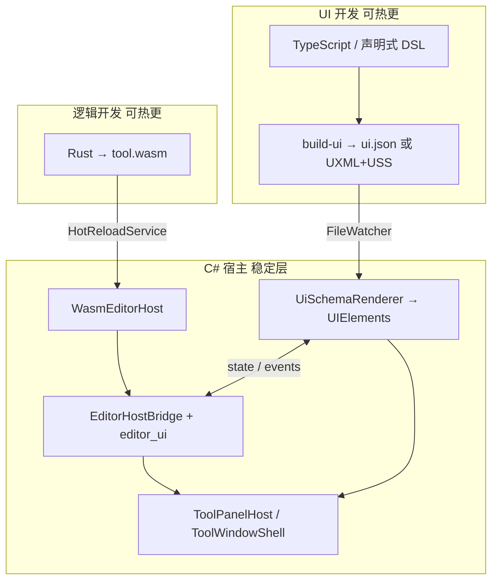
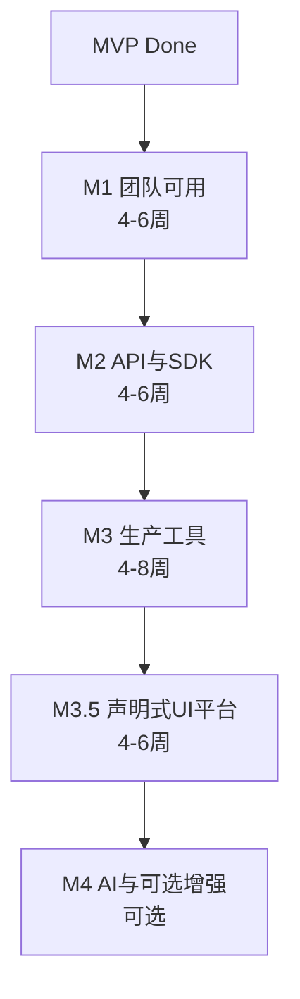

# unity-wasm 开发路线图（M1–M4 + UI 平台）

> **文档用途**：后续分阶段 Plan 与实现的**总纲**。每个里程碑将单独产出详细 Plan（如 [M1 Plan](../.cursor/plans/m1_team_ready_plan_cc64b348.plan.md)）并编码。
>
> **最后更新**：2026-06-21（整合 UI 策略、开源参考、M3.5 声明式 UI 平台；WebView 降为可选）

---

## 0. 项目定位

| 项 | 内容 |
|----|------|
| 产品 | Unity Editor WASM 扩展平台（`com.fumo.editor-wasm`） |
| 用户 | 引擎工具组 / 客户端工具组 |
| 运行环境 | Unity **2022.3 LTS** Editor（Win / macOS / Linux） |
| 明确不做 | 游戏运行时 Mod、出包、IL2CPP、移动端、完整 `UnityEditor` 反射暴露 |

**核心价值排序**：

1. 崩溃隔离（WASM 沙箱）
2. **双热更** — 逻辑（`.wasm`）与 UI（声明式资产）均避免 Domain Reload
3. 多语言工具（Rust 为主，AS 可选）
4. Unity **原生 GUI 观感**（UI Toolkit，非 WebView 默认）
5. 现代调试 + AI 友好 Schema

---

## 1. 当前基线（MVP Done）

### 1.1 已实现

| 类别 | 内容 |
|------|------|
| 运行时 | Wasmtime .NET + Native；`WasmEditorHost`（Load/Call/Unload、Fuel、MemoryLimit、TrapReport） |
| Host API | `editor_core`、`editor_selection`、`editor_assets`（Tier 0–2，C# 手工实现） |
| 基础设施 | `ToolDiscoveryService`、`HotReloadService`（300ms debounce）、`HandlePool`、`ToolWindowShell` |
| 契约 | `wit/editor-api/`（文档级 WIT，与实现未完全代码生成联动） |
| 示例 | `examples/selection-logger` |
| 辅助 | Schema/Registry 导出、`HostBindingGenerator`（基础）、`WebViewBridge`/`SelfHealingLoop`（占位） |
| 工程 | `sample-project`、`.gitignore`、`docs/*` |

### 1.2 已知缺口（驱动 M1+）

1. 工具菜单写死（`tool.json.menu` 未驱动动态入口）
2. WIT 与 C# / Rust 实现双轨（无 wit-bindgen / Host 生成）
3. 仅 1 个示例，Tier 2 未经真实工具验证
4. 无 Tier 3（Scene 只读）/ Tier 4（写操作）/ **`editor_ui`（UI 绑定）**
5. 无正式 Rust SDK 模板
6. **UI 仅手写 UIElements Shell**，无 TS/声明式 UI 热更路径

---

## 2. 总体架构：双热更 + 原生渲染

### 2.1 设计原则（已决策）

| 原则 | 说明 |
|------|------|
| **宿主 C# 薄且稳定** | 平台组维护；变更触发 Domain Reload，应尽量少 |
| **逻辑在 WASM** | Rust（重计算）/ AS（轻逻辑）；`.wasm` 热更 |
| **UI 在声明式资产** | 不生成 C# `EditorWindow` 业务代码；热更 `ui.json` / UXML+USS |
| **渲染在 UITK** | 原生 Editor 主题；**默认不用 WebView** |
| **WebView 可选** | 仅极少数复杂可视化工具（节点图、大表格），M4 POC |

### 2.2 目标架构



### 2.3 UI 路线对比（M3.5 前 Spike 定案）

| 路线 | 热更 UI | 原生观感 | 2022.3 可行 | 推荐 |
|------|---------|----------|-------------|------|
| A. `ui.json` + C# `UiSchemaRenderer` | 是 | 高 | 是 | **默认首选** |
| B. TS → UXML/USS + FileWatcher 重载 | 是 | 高 | 是（Live Reload 在 Unity 6 更完整；2022 可 FileWatcher 读字符串挂载） | 备选 |
| C. TS/JSX → UITK（OneJS 式桥接） | 是 | 高 | 需评估依赖 | M3.5 Spike |
| D. TS → 生成 C# EditorWindow | 否 | 高 | 是 | **不采用** |
| E. 纯 WebView + React | UI 热更好 | 低 | 是 | **仅 M4 可选 POC** |

### 2.4 开源参考（按层组合，无一体化现成项目）

| 层 | 参考项目 | 借鉴点 |
|----|----------|--------|
| WASM 宿主 | [godot-wasm](https://github.com/ashtonmeuser/godot-wasm)（工作区） | load/import/热换模块、Capability API |
| Unity + Wasmtime | [Wasmbox](https://placeholder-software.github.io/wasmbox/)、[wasmtime-dotnet-unity](https://github.com/mochi-neko/wasmtime-dotnet-unity) | Linker、Editor 集成 |
| WIT 插件 | [wit-bindgen](https://github.com/bytecodealliance/wit-bindgen)、[Wasmtime wasip2 plugins](https://bytecodealliance.github.io/wasmtime/wasip2-plugins.html) | M2 契约与加载流程 |
| **UI：TS → 原生 UITK** | **[OneJS](https://github.com/Singtaa/OneJS)**、**[Preactor](https://github.com/Rikarin/preactor/)** | JSX/Preact→UITK、无 WebView、watch 热更 |
| Loader / 白名单 | [xLua](file:///home/furrymonster/Projects/Utils/UnityPlugins/xLua)（工作区） | CustomLoader、GenAttributes、Tutorial |
| C# 热更（对照，非主路径） | [FastScriptReload](https://github.com/handzlikchris/FastScriptReload) | 说明 Domain Reload 问题与「动字节码/资产」思路 |

---

## 3. 里程碑总览



| 里程碑 | 一句话目标 | 完成后能做什么 |
|--------|------------|----------------|
| **M1** | 多人独立开发第 2、3 个工具 | 加 `tool.json` 即可 Run，零 C# 改动 |
| **M2** | WIT 与实现一致，Rust SDK 正式化 | 改 WIT → 生成绑定；ABI 校验 |
| **M3** | 支撑扫描/检查类生产工具 | 大项目资产遍历、mutating + Undo |
| **M3.5** | **Web 式 UI 效率 + UITK 原生观感** | TS/JSON 热更 UI + WASM 逻辑分离 |
| **M4** | AI 上下文 + 半自动修复；WebView 仅 POC | Agent 包、Trap 闭环；复杂 UI 试点 |

**依赖**：M2 依赖 M1 双示例反馈；M3 依赖 M2 ABI；**M3.5 依赖 M1 工具流程 + M2 的 WIT 扩展能力**；M4 依赖 M2 SDK。

---

## 4. M1 — 团队可用

> 详细 Plan：[m1_team_ready_plan](../.cursor/plans/m1_team_ready_plan_cc64b348.plan.md)

### 4.1 目标

从 Demo 升级为工具组日常接活：动态入口、第二示例、Rust 模板、开发者文档。

### 4.2 交付物

| ID | 交付物 |
|----|--------|
| M1-D1 | 动态工具入口（Run Tool 弹窗 + Tool Shell Run） |
| M1-D2 | `examples/asset-scanner` |
| M1-D3 | `sdk/rust/template` |
| M1-D4 | Tool Shell 增强（列表 / Run / Trap 复制 / last reload） |
| M1-D5 | `docs/getting-started-tool-dev.md` |

### 4.3 任务索引

| 任务 | 要点 |
|------|------|
| M1-T1 | `Tools → Wasm Editor → Run Tool...` 工具选择弹窗；删硬编码 `RunSelectionLogger` |
| M1-T2 | asset-scanner：Tier 2 + progress |
| M1-T3 | Rust 模板 + `CARGO_TARGET_DIR=target` |
| M1-T4 | Tool Shell Launcher UI |
| M1-T5 | 工具开发者文档 |
| M1-T6 | （可选）`tool.json.shortcut` |

### 4.4 验收

- [ ] ≥2 示例可发现、Run、热重载
- [ ] 第 3 个工具由工具组按模板独立完成
- [ ] getting-started 文档可指导新人

### 4.5 风险

| 风险 | 缓解 |
|------|------|
| Unity 不支持 MenuItem 动态 GenericMenu | 使用 `RunToolWindow`（ShowPopup）；Tool Shell 为完整入口 |
| asset-scanner 卡顿 | M1 允许同步+进度条；M3 分帧 |

---

## 5. M2 — API 与 SDK 正式化

### 5.1 目标

WIT/C#/Rust 单一真理；ABI 版本；Tier 3 只读 Scene；调试可复现。

### 5.2 交付物

| ID | 交付物 |
|----|--------|
| M2-D1 | ABI 版本校验（`tool.json.abi`） |
| M2-D2 | WIT → Host import 生成 **或** 契约测试（Spike 定案） |
| M2-D3 | Rust wit-bindgen workflow |
| M2-D4 | Tier 3 `editor-scene` |
| M2-D5 | `examples/prefab-inspector-lite` |
| M2-D6 | 契约 instantiate CI |
| M2-D7 | Verbose import log + `docs/debugging.md` |

### 5.3 待定决策（M2 Plan 必须定案）

| 议题 | 选项 | 建议 |
|------|------|------|
| Host 绑定 | A. WIT 生成 `EditorHostBridge.Imports.g.cs` / B. 契约测试 + 手写 | Spike 1–2 天后选；M2 入口 |
| wit-bindgen 目标 | core wasm vs component model | 与 Wasmtime 16.x 能力对齐后再定 |

### 5.4 验收

- [ ] WIT enforce（生成或测试）
- [ ] ≥1 示例用 wit-bindgen
- [ ] ABI mismatch fail-fast

---

## 6. M3 — 生产级工具支撑

### 6.1 目标

真实工具链：扫描/检查/导出；性能规范；可控写操作。

### 6.2 交付物

| ID | 交付物 |
|----|--------|
| M3-D1 | `docs/performance.md` |
| M3-D2 | Host 分帧/batch（按需） |
| M3-D3 | Tier 4 `editor-mutating` + Undo |
| M3-D4 | 示例：prefab-checker 或 csv-export-lite |
| M3-D5 | 多工具 HandlePool 隔离审计 |
| M3-D6 | AssemblyScript 模板（可选） |

### 6.3 验收

- [ ] ≥1 生产复杂度示例 daily use
- [ ] mutating 有独立 WIT interface + Undo
- [ ] 内部 ≥3 个日常 wasm 工具

---

## 7. M3.5 — 声明式 UI 平台（新增）

### 7.1 目标

实现 **「TS/Web 式 UI 开发效率 + UITK 原生观感 + WASM 逻辑热更」**，不依赖 WebView 作为默认方案。

### 7.2 交付物

| ID | 交付物 |
|----|--------|
| M35-D1 | `docs/ui-strategy.md`（定案路线 A/B/C） |
| M35-D2 | WIT Tier **`editor_ui`** + Host 实现 |
| M35-D3 | `UiSchemaRenderer`（`ui.json` → VisualElement 树） |
| M35-D4 | `ToolPanelHost`：每工具可挂载独立 UI 面板 |
| M35-D5 | UI 热更：`ui.json` / `.uss` FileWatcher |
| M35-D6 | `sdk/typescript/ui-template` 或 `sdk/ui-schema/` |
| M35-D7 | 示例：`asset-scanner-panel`（UI + wasm 分离） |
| M35-D8 | （Spike）OneJS/Preactor 架构阅读笔记与是否引入评估 |

### 7.3 `editor_ui` Host API（草案）

| Import | 用途 |
|--------|------|
| `set_control_text(id, text)` | 标签/按钮文案 |
| `set_list_items(id, bulk_ptr)` | 列表数据（FMBO） |
| `get_toggle(id) -> bool` | 读取控件状态 |
| `notify_ui_event(name, payload_ptr)` | UI → WASM 事件 |

WASM export 扩展：`on_ui_event(name)`（可选，与 `on_menu_click` 并列）。

### 7.4 工具包结构（M3.5 后）

```
my-tool/
├── tool.json
├── bin/tool.wasm
├── ui/
│   ├── ui.json          # 或 panel.uxml + panel.uss
│   └── bindings.json    # 控件 id ↔ WASM 事件
└── src/                 # Rust
```

### 7.5 开发工作流（目标体验）

```bash
# 终端 1：UI
cd my-tool/ui && npm run dev    # → ui.json

# 终端 2：逻辑
cd my-tool && cargo watch ...   # → tool.wasm

# Unity：Refresh 一次，之后双 watcher 自动 reload
```

### 7.6 任务分解

| 任务 | 内容 |
|------|------|
| M35-T0 | UI 路线 Spike（2–3 天）：ui.json vs UXML vs OneJS 模式对比 |
| M35-T1 | `editor_ui` WIT + Host |
| M35-T2 | `UiSchemaRenderer` MVP（Button、Label、ListView、ProgressBar） |
| M35-T3 | `ToolPanelHost` + 与 `HotReloadService` 联动 |
| M35-T4 | UI FileWatcher + Shell 状态保留（滚动位置等） |
| M35-T5 | asset-scanner 拆分为 ui + wasm 示例 |
| M35-T6 | TS/UI 模板与文档 |

### 7.7 验收

- [ ] 修改 `ui.json` 5 秒内 Shell 刷新，**无 Domain Reload**
- [ ] 修改 `tool.wasm` 仍独立热更（M1 能力保持）
- [ ] 观感与现有 Editor 窗口一致（Editor 主题 USS）
- [ ] 不引入 WebView 依赖

### 7.8 风险

| 风险 | 缓解 |
|------|------|
| Unity 2022.3 UITK Live Reload 功能弱于 Unity 6 | 自建 FileWatcher + 字符串重载 UXML |
| ui.json 表达力不足 | 预留 UXML 路线；复杂控件渐进添加 |
| OneJS 依赖 Editor/运行时假设 | 只借鉴架构，不直接依赖包；M35-T0 评估 |

---

## 8. M4 — AI 与可选增强（非核心）

### 8.1 目标调整（相对原 roadmap）

**原**：Web 富 UI + AI 为主。  
**现**：**AI 上下文与半自动修复为主**；WebView **仅**面向极少数复杂工具的 POC。

### 8.2 交付物

| ID | 交付物 | 优先级 |
|----|--------|--------|
| M4-D1 | `schemas/agent-context.json` 一键导出 | 高 |
| M4-D2 | Self-Healing 文档 + CLI（Trap JSON → rebuild 指引） | 高 |
| M4-D3 | `docs/webview-evaluation.md` + 可选 POC | 低 |
| M4-D4 | WebViewBridge 完整协议（若 POC 通过） | 低 |
| M4-D5 | 动态 HTML 注入 sandbox（仅 POC） | 低 |

### 8.3 验收

- [ ] Agent 上下文包可被外部 Agent 生成合法 guest 骨架
- [ ] Trap → fix-request → rebuild → reload 流程文档化可走通
- [ ] WebView POC：**可选**，不作为平台标配

### 8.4 前置条件

- M2 SDK 稳定
- M3.5 UI 平台可用（避免 AI 生成 UI 时无稳定契约）

---

## 9. 横切关注点

### 9.1 文档同步

Host / UI / WIT 变更须同步：`wit/`、`docs/host-api.md`、`schemas/`、至少一个 example。

### 9.2 分支策略

| 分支 | 用途 |
|------|------|
| `main` | 稳定 ABI + examples 可编译 |
| `feature/editor-api-2` | breaking ABI |
| `feature/editor-ui-1` | M3.5 UI 平台 |

### 9.3 测试策略

| 层级 | M1 | M2 | M3 | M3.5 | M4 |
|------|----|----|-----|------|-----|
| wasm 本地 build 脚本 | ✓ | ✓ | ✓ | ✓ | ✓ |
| 契约 instantiate（CI，M2+ 可选） | | ✓ | ✓ | ✓ | ✓ |
| ui.json schema 校验 | | | | ✓ | |
| sample-project 人工 | ✓ | ✓ | ✓ | ✓ | ✓ |

### 9.4 平台矩阵

每里程碑：Linux / Windows / macOS Editor smoke test。

---

## 10. 后续 Plan 编写指引

```markdown
# Mx — 标题
## 范围（In / Out）
## 依赖
## 任务（引用 Mx-Tn）
## 文件级变更
## 验收清单
## PR 竖切顺序
```

**M1 PR 顺序**（已定）：T1 → T2 → T3 → T4 → T5  
**M3.5 PR 顺序**（建议）：T0 Spike → T1 editor_ui → T2 Renderer → T3 PanelHost → T4 Watch → T5 示例

---

## 11. 成功指标（项目级）

| 时间点 | 指标 |
|--------|------|
| M1 | ≥3 wasm 工具；零 C# 加工具 |
| M2 | WIT/Host/Rust CI enforce |
| M3 | ≥1 生产工具 daily use |
| M3.5 | UI/逻辑 **双热更**；无 WebView 依赖 |
| M4 | Agent 上下文包 + Self-Healing 流程可用 |

---

## 12. 决策记录（ADR）

| 日期 | 决策 | 理由 |
|------|------|------|
| MVP | Wasmtime .NET Editor-only | scope 一致 |
| MVP | UIElements Shell 先于 WebView | 降依赖、原生观感 |
| 2026-06 | **WebView 非默认 UI** | 过重；OneJS 式 UITK 桥更合适 |
| 2026-06 | **双热更架构** | wasm 逻辑 + 声明式 UI 资产 |
| 2026-06 | **不采用 TS→C# EditorWindow** | Domain Reload 丢热更 |
| 2026-06 | 新增 **M3.5 声明式 UI 平台** | 承接 Web 式 UI 需求 |
| 2026-06 | **M1 不做 CI** | 团队不需要；wasm 本地 build + 预编译提交 |
| 待定 M2 | Host 生成 vs 契约测试 | M2 Spike |
| 待定 M3.5 | ui.json vs UXML vs OneJS 式 | M35-T0 Spike |

---

## 13. 待确认问题（Plan 前需对齐）

1. **M3.5 UI 路线**：团队更熟悉 TS/React 还是愿直接用 `ui.json`？（影响 M35-T0 结论）
2. **OneJS 是否可复用**：仅借鉴架构 vs 引入依赖（License、2022.3 兼容性需评估）
3. **工具 UI 放置路径**：仅 `examples/*/ui/` 还是支持 `Assets/Editor/Tools/*/ui/`（建议两者皆支持）
4. **M2 component model**：是否在 M2 即切换 component wasm，还是 M2 末再定（影响 wit-bindgen 工具链）

---

## 附录 A：Host API 演进

| Tier | 接口 | MVP | M1 | M2 | M3 | M3.5 |
|------|------|-----|----|----|-----|------|
| 0 core | log, progress, time | ✓ | | | | |
| 1 selection | handles, paths | ✓ | | | | |
| 2 assets | find, load, bulk | ✓ | 验证 | 契约 | 分帧 | |
| 3 scene | path, serialized read | | | ✓ | | |
| 4 mutating | set property, save | | | | ✓ | |
| **5 ui** | set_text, list, events | | | | | **✓** |

## 附录 B：示例工具演进

| 工具 | 里程碑 | 验证点 |
|------|--------|--------|
| selection-logger | MVP | Tier 1 |
| asset-scanner | M1 | Tier 2 + progress |
| prefab-inspector-lite | M2 | Tier 3 |
| prefab-checker / csv-export | M3 | 生产复杂度 |
| **asset-scanner-panel** | **M3.5** | **UI+wasm 双热更** |
| web-panel-demo | M4（可选） | WebView POC |

## 附录 C：与 xLua / godot-wasm 对照

| 能力 | xLua | godot-wasm | unity-wasm 目标 |
|------|------|------------|-----------------|
| 沙箱 | 弱 | 强 | 强（WASM） |
| 热更逻辑 | Lua 脚本 | wasm 模块 | wasm |
| 热更 UI | — | — | **ui.json/UXML（M3.5）** |
| API 暴露 | 反射+白名单 | import_map | WIT + Host |
| 多语言 | Lua | 任意→wasm | Rust/AS |

---

*各 Mx Plan 完成后，在 §12 ADR 追加链接与定案记录。*
